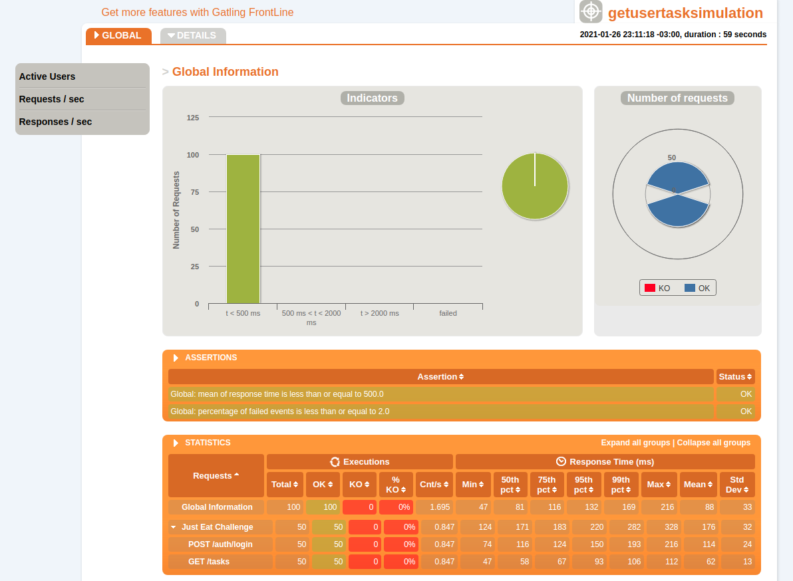

# Just Eat QA Coding Challenge - Performance Tests

## Installation

Use [gradle](https://gradle.org/) to build and install the dependencies.

```bash
gradle build
```

- Java JDK: 1.8.0_282
- Scala SDK: 2.12.11
- Gradle: 5.5.1

# Usage
- It's a simple project which contains only 2 scenarios
- I'm using [Gatling.io](https://gatling.io/) to implement the simulation

## Running the Performance Tests

To run the performance tests, run the command below:

```bash
./gradlew gatlingRun
```

Once it's done you can check for results in `build/reports/gatling`

## Repo Structure and Approach

The test scenarios are in the package `com/justeat/tasks/scenarios` and 
the simulation class which gatling understand as "tests to run" are under `com/justeat/tasks/simulation`

### Gatling Report Sample:


**Note:** This is an interactive report, for better experience check it on the reports folder.

